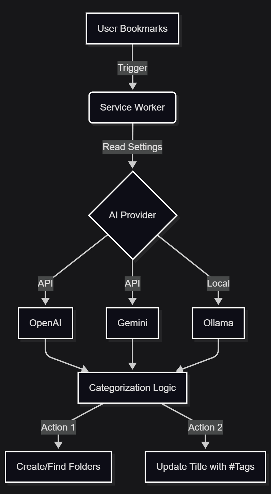

# 🧠 Smart Bookmarks

> **Stop drowning in "Unsorted Bookmarks". Let AI organize your web life.**


**Smart Bookmarks** is a cross-browser extension that intercepts new bookmarks and uses Large Language Models (LLMs) to automatically categorize them into a recursive folder structure. It transforms a flat list of links into a well-organized knowledge base.

## ✨ Key Features

* **🤖 Multi-LLM Support:** Choose your brain. Supports **OpenAI (GPT-4o)**, **Anthropic Claude**, **Google Gemini** (Free Tier available), **DeepSeek**, and **Ollama** (Local Privacy).
* **📂 Recursive Categorization:** It doesn't just guess a category; it builds a path.
    * *Input:* A tutorial on React Hooks.
    * *Output:* Creates `Development > Web > React` folders automatically.
* **🔒 Privacy-First Architecture:** Your API keys are stored in `chrome.storage.sync` (encrypted by the browser) and are never sent to any intermediate server.
* **🧪 Debug Playground:** Includes a "Dry Run" mode in settings to test your prompts without cluttering your actual bookmarks.

---

## 🛠️ Architecture

This project uses **Manifest V3** service workers to handle events asynchronously.



---

## 🚀 Installation Guide

### Prerequisites

You will need an API Key from one of the following providers:

* **Google Gemini:** [Get a Free Key](https://aistudio.google.com/app/apikey) (Recommended for free usage).
* **Anthropic Claude:** [Get API Key](https://console.anthropic.com/).
* **OpenAI:** [Get API Key](https://platform.openai.com/api-keys) (Requires credit).
* **DeepSeek:** [Get API Key](https://platform.deepseek.com/).
* **Ollama:** [Download Ollama](https://ollama.com/) (Free, runs locally).

### Option A: Chrome / Edge / Brave

1. Clone this repository:
```bash
git clone https://github.com/Savitar608/smart-bookmarks.git
```


2. Open Chrome and navigate to `chrome://extensions/`.
3. Toggle **Developer mode** (top right corner).
4. Click **Load unpacked**.
5. Select the `smart-bookmarks` folder from your computer.

### Option B: Firefox

1. Clone the repository.
2. **Important:** Rename `manifest.firefox.json` to `manifest.json` (this will replace the default Chrome manifest).
3. Open Firefox and navigate to `about:debugging#/runtime/this-firefox`.
4. Click **Load Temporary Add-on...**.
5. Select the `manifest.json` file inside the project folder.

---

## ⚙️ Configuration

1. Click the **Smart Bookmarks** icon in your toolbar and select **Options**.
2. **Select Provider:** Choose between OpenAI, Claude, Gemini, DeepSeek, or Ollama.
3. **Enter API Key:** Paste your key.
* *Note for Ollama Users:* Ensure your local server is running (`ollama serve`). The default URL is `http://localhost:11434`.


4. **(Optional) Test It:** Use the "Debug Playground" at the bottom of the page to categorize a test URL and see the result.
5. Click **Save**.

### Advanced Configuration (Developers)

To change the default models (e.g. `gpt-4o` vs `gpt-3.5`), API endpoints, or the System Prompt used for classification, edit `src/config.js`. This allows you to customize the extension's behavior without diving into the core logic.

---

## 🐛 Troubleshooting

| Issue | Possible Cause | Solution |
| --- | --- | --- |
| **Nothing happens when I bookmark** | Extension sleeping | The service worker might be idle. Reload the extension in settings. |
| **"API Error" in Console** | Invalid Key | Check if your API Key has quota/credit remaining. |
| **Ollama connection failed** | CORS / Server Down | Ensure Ollama is running and start it with `OLLAMA_ORIGINS="*"` environment variable. |
| **Folders created in wrong place** | Root ID Mismatch | The extension defaults to "Other Bookmarks". You can drag folders manually if needed. |

---

## 🛣️ Roadmap

* [ ] **Context Menu:** Right-click a page to "Bookmark with Custom Note".
* [ ] **History Organizer:** Batch organize past bookmarks (Caution: destructive action).
* [ ] **Local LLM Embedding:** Use Chrome's experimental built-in Nano model (Zero API keys).

---

## 🤝 Contributing

Contributions are welcome! Please open an issue to discuss major changes.

1. Fork the Project
2. Create your Feature Branch (`git checkout -b feature/AmazingFeature`)
3. Commit your Changes (`git commit -m 'Add some AmazingFeature'`)
4. Push to the Branch (`git push origin feature/AmazingFeature`)
5. Open a Pull Request

## 📄 License

Distributed under the MIT License. See `LICENSE` for more information.